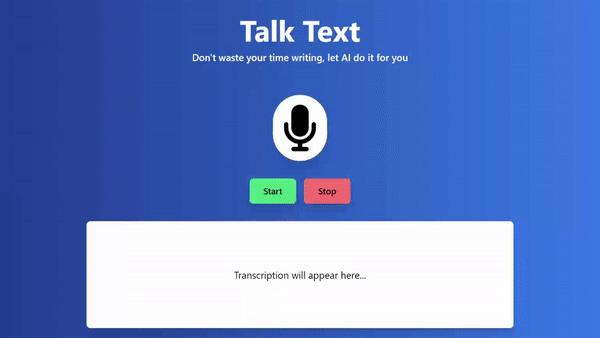
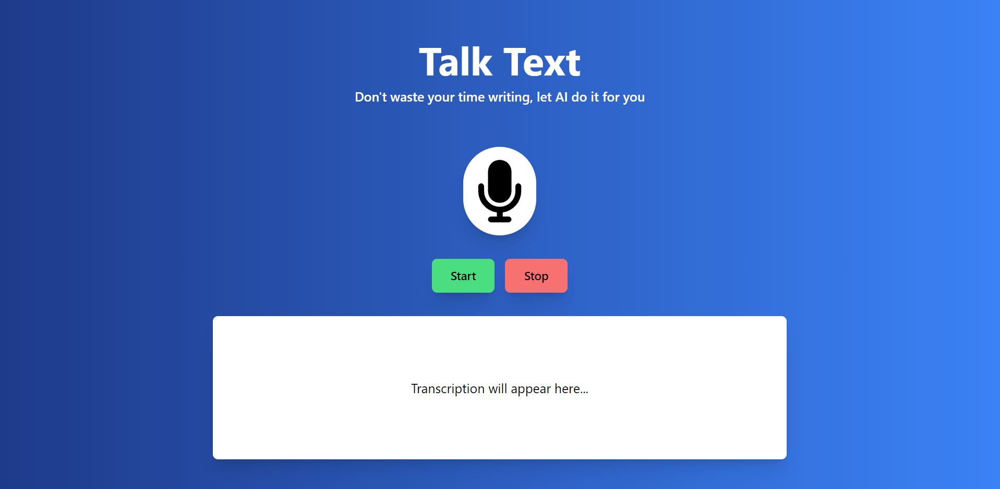
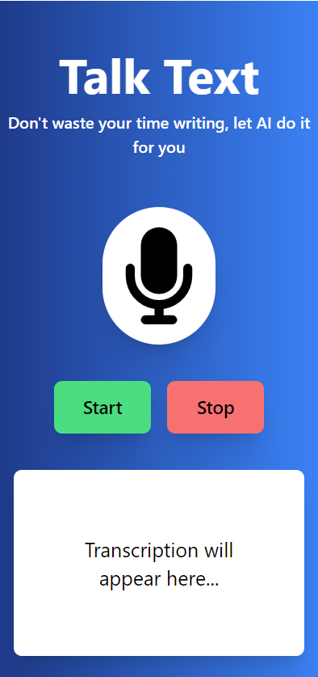

# Talk Text



### About

Unleash the power of your voice with the Talk Text, your AI-powered transcription sidekick that turns audio into text at lightning speed! 🚀

### Index

-   <a href="#layout">Layout</a>
-   <a href="#requirements">Requirements</a>
-   <a href="#demonstration">Demonstration</a>
-   <a href="#technologies-used">Technologies used</a>

### Layout

<p align="center">
  
</p>

<p align="center">
  
</p>

### Requirements

Before getting started, make sure your machine has the following tools: [Git](https://git-scm.com/), [Node.js](https://nodejs.org/en). It is important to have a code editor too, such as [VSCode](https://code.visualstudio.com/).

```bash
# Clone this repository
$ git clone https://github.com/eduvarjaor/talk-text.git

# Access project folder
$ cd talk-text/client

# Install dependencies
$ npm i

# Execute the project in development mode
$ npm run dev

# The server will open on port:5173 - access http://localhost:5173/
```

### Demonstration

[Talk Text](https://talktext.netlify.app/)

### Technologies used

The project uses these tools:

1. [Vue.js](https://vuejs.org/)
2. [Javascript](https://developer.mozilla.org/en-US/docs/Web/JavaScript)
3. [TailwindCSS](https://tailwindcss.com/)
4. [Node.js](https://nodejs.org/en)
5. [Firebase](https://firebase.google.com/docs)

---

Made with 💙 by eduvarjaor 👋 [See my LinkedIn](https://www.linkedin.com/in/eduvarjaor/?locale=en_US)
